# Description  
- [SimplyFitness](https://simply-fitness.herokuapp.com/) is a fictional gym created for this project. The main objective for creating this website is to make the general public aware of key features within the gym whilst motiving clients to better their fitness regime. 
Additionally, It will allow people to register with the gym thus subsequently become a member of the ‘Simple Fitness’ company. Once becoming a member, users can gain access to their profiles which will contain key personal details. 
This data will be stored in a distinct order to ensure each profile is unique. 

<p align="center">
  
</p>

________________________________

# UX
### **Home Page:**
- This is the forefront page for the ‘Simple Fitness’ website. Its purpose is to create awareness of what the ‘Simple Fitnesss’ gym can intel and where it is located. The images placed on this web page are specifically designed to show users a visual representation of what they can expect when visiting the gym.

### **Services Page:**
- This page is targeted to provide the general public with knowledgeable information on what services 'Simple Fitness’ has to offer such as, Weights training classes and boot camp. It also informs users on what extra facilities are included within the gym.

### **Profile Page:**
- When becoming a member with ‘Simple Fitness’, each individual will gain access to their profile. This page will contain each user's username, email address, and home address. Each profile is only visible to the registered user when they log into their account and is kept private and confidential.
The profile page also contains the subscription level that the user has chosen with an image of the level for better user visuals. This page then leads on to updating the detail through a button provided at the bottom of the Profile Page, where the user can edit their details.
Every user must confirm their username and password once they have changed their details to save them. If the Username and/or Password are incorrect the changes will be cancelled and the user is returned to editing with an appropriate message displayed. 

### **Classes Page:**
- When becoming a registered member with ‘Simple Fitness’, each individual will gain the privilege to book classes via the website. This page is purely designed for members to gain access/amend those bookings and to create new ones. This page is organised with 6 images displayed at the top providing the user with an idea of what classes can be booked. 
After the images, a form is provided for the user to book their classes for a specific date and time with additional notes if required. Once a class is booked, it is then displayed below in the classes booked section where the user has access to amend or delete only their classes. 

### **Log In Page:**
- This section of the website is designed to allow users to access their profiles. It is only visible on the website when the user hasn't logged into their portal. User will only be allowed to log in if they are already registered and only if the password matches with the given username which is stored in the database. 

### **Register Page:**
- To become a member of ‘Simple Fitness’, each individual will need to register with the company. This page allows users to create a membership by entering a few personal details. Once the details have been recorded, the individual will become a member and begin their journey with ‘Simple Fitness’ gym. 
This page contains a form containing Subscription Level, Full Name, Email, Home Address, Username and Password. 
________________________________

#  User Stories
### **User:**
- As a user, I would like to know what the gym looks like with a location. 
- As a user, I would like to know what services the gym has to offer. 
- As a user, I would like to know what different packages are on offer and suitable for my needs.
- As a user, I would like to upgrade/downgrade my package suitable for my situation at the time.  
- As a user, I would like to know if any extra support can be provided to improve my fitness level. 
- As a user, I would like to gain access to the extra support provided and be able to edit or remove it.

### **Actions taken to accomplish these goals are:**
- Main image has been included for the user to get an idea of what this gym looks like. 
- Home page is provided with a map so the user can see the location of the gym.
- Packages on offer are shown at the registration level with the details, so the user can select the one best suited for them, that can be changed as and when needed. 
- For extra support, the User can also book classes provided by the gym containing different categories, such as boxing, bike, weights and swimming. 
- Classes booked are visible for the user so they can track when their next class is and also they can edit these classes to change the date and time according to their availability. 

________________________________

# Data Structure, Views and Features
- Data Structure was pre-planned for this project, so the user can easily register, create, update, view details and delete details. To achieve this [MongoDB](https://www.mongodb.com/) was used, 
Where I created three collections to store data in them in an organised manner. Where users collection was used to store the database for registered user. 
Categories collection was used to store all different classes options the user can book. This is used for selecting a class in the process to book a class. 
Tasks collection was used to store all the details regarding the class that has been booked for the specific user. 
<p align="center">Collections stored in MongoDB</p>
<p align="center">
  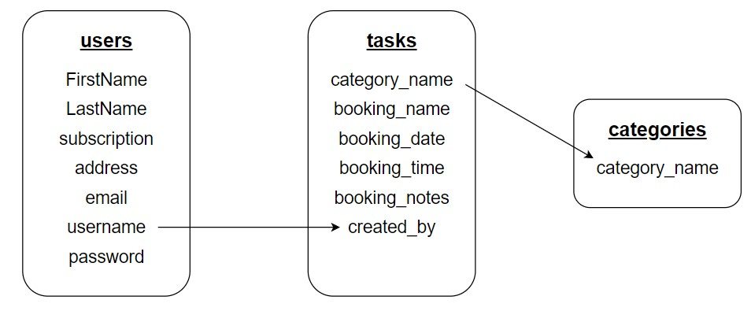
</p>

- Working through HTML, CSS and Javascript in my previous projects had taught me how planning and research are key elements in web development. Keeping my main focus on the new language, Python being learnt
in this project I decided to use [Business Casual template](https://startbootstrap.com/previews/business-casual) from start bootstrap. Keeping the same structure as the template I made changes to create different information, content and pages.

    ### **Home Page:**
    - Home Page consists of two sections, the main image at the top with a small message to motivate the user to join us. Join us button has a feature to navigate the user to the registration page or LogIn page if already registered. 
    After the hero image home page will lead the user to find the location of the gym which is shown via google maps including a marker to show the exact location. 
    <p align="center">Home Page Overview</p>
    <p align="center">
    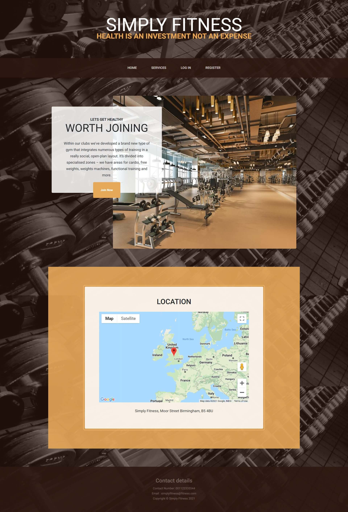
    </p>


    ### **Services Page:**
    - Service Page contains the services the gym has to offer with images for the user. This page contains the images of the classes and different areas in the gym with a message next to them as a description. 
    Each description contains a button feature leading the logged-in user to book a class; if not yet logged in then it will lead the user to the login page. 
    <p align="center">Services Page Overview</p>
    <p align="center">
    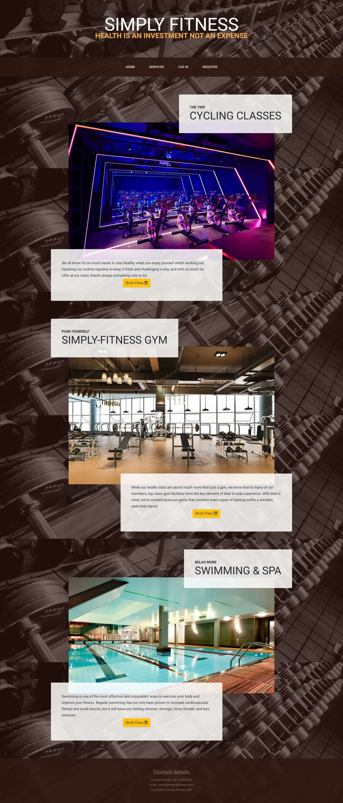
    </p>

    ### **Profile Page:** 
    - Differentiating this page from the previous pages, this page is only visible if the user is registered so the user can access their profile. Profile Page consists of personal details displayed. 
    User can also view their subscription on this page including an image describing the subscription level. Another feature included on the page is the update button. Which leads the user to the profile editing page.
    Once the user has logged in and they decide to share the link, it will give the new user an error as they haven't yet logged in; to resolve this I have added an error handling function so the user to open the
    the shared link will be directed to the login page instead. 
        <p align="center">Profile Page Overview</p>
        <p align="center">
        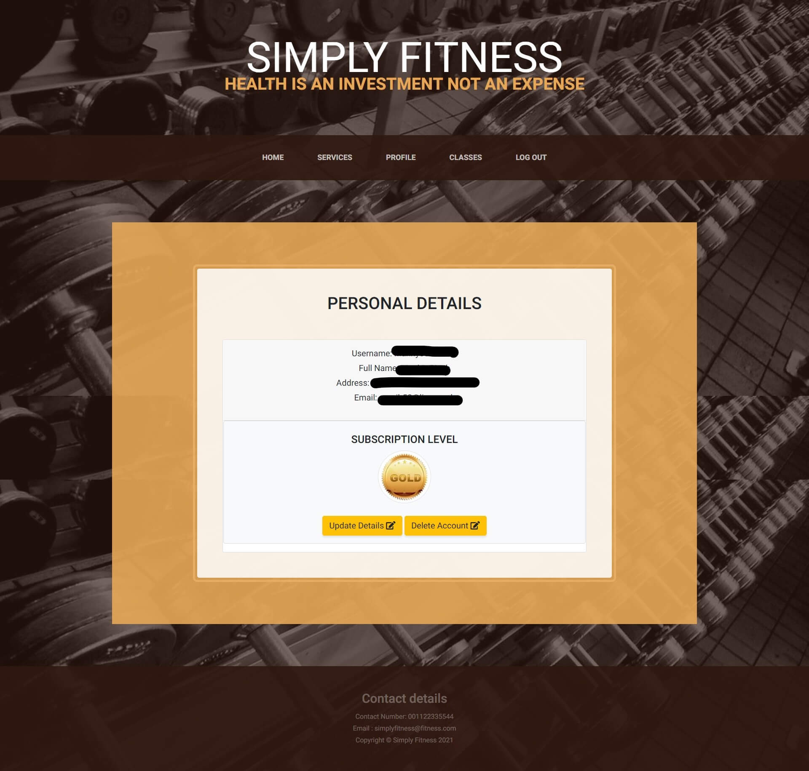
        </p> 
        
        #### **Edit Profile**:
        - User is headed to this page once they have chosen to edit the details on the Profile page. This page allows users to edit all their details including subscription level.
        However, for safety purpose, the user has to confirm the username and password. This page also has two buttons, one is to cancel the changes which lead the user back to the profile page without any amendments. 
        The second button is to save the changed and once selected the user is shown an appropriate message to confirm the changes. 

    ### **Classes Page:**
    - Similarly to Profile Page, this is also only visible to a registered user whilst logged in. This page contains 6 images at the top supporting the classes that are available for booking.
    After the images, the user is provided with two accordion options, both options are closed to start with but expand once selected. 
        - First option given leads the user onto the Booking a class.
        This accordion contains a form for the user to submit to book a class which then is stored in a MongoDB collection. The form consists of inputs to gather information, such as 
        Full Name, Class they want to book, Date and time the booking is for and further text if the user wants to add any details or preference. When submitted, the information about the username is also stored in the collection. 

        - Second Option given in the accordion is for the user to view the booked classes. As the user who created the class is also saved in MongoDB, it helps show classes that are booked by the current user only. 
        This accordion gets the details from MongoDB collection, to then present to the user, where the user gets two options;
        whether to edit the booking already made or to delete it if unable to attend. Where the delete button is just to remove the information, the edit button leads the user onto the class editing page. 
        <p align="center">Classes Page Overview</p>
        <p align="center">
        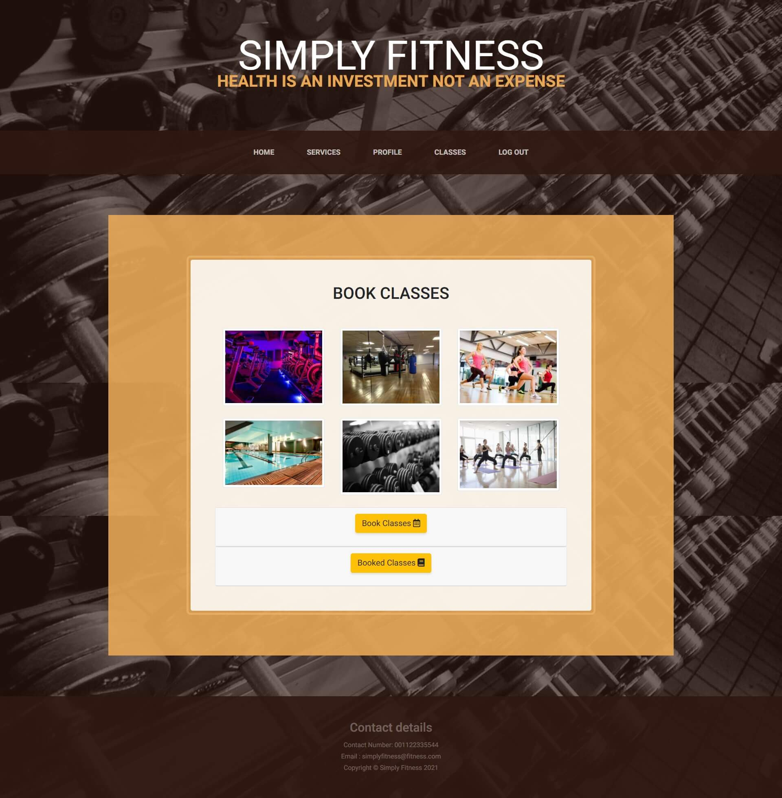
        </p>

        #### **Edit Classes**:
        - User is lead to this page once they have chosen to edit the details for the class already booked. This page consists of a similar form prefilled with previous booking details where the user can edit them accordingly.
        Supporting the form, there are two buttons provided for the user to take action. The first button is to cancel the editing, which doesn't save any changes and leads the user back to the booked classes.
        The second button is to save the changes, which will also be changed in MongoDB, therefore updating the details shown in the booked classes accordion as well. 

    ### **Login Page:** 
    - This page is only accessible when the user isn't already logged in. Features given on this page are to help the user login.
    There are two inputs provided for the user on this page, where both the Username and the Password has to be matching the information stored in MongoDB collection otherwise an appropriate message is shown for the user.
    If the user hasn't yet registered, there is a message displayed containing a link to lead the user to the registration page.
    Once the user manages to login they are directed to the profile page, which contains a logout button in the navbar for the user to logout once finished using the website for the time being. 
    <p align="center">LogIn Page Overview</p>
    <p align="center">
    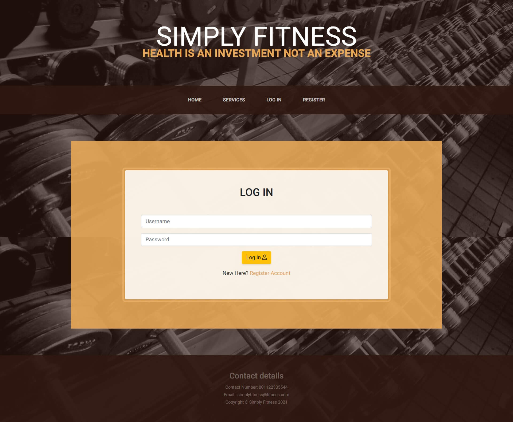
    </p>

    ### **Registration Page:**
    - This page is accessible when the user isn't already logged in or isn't already registered. This page consists of a form containing Subscription levels for choice at the start. Subscription levels are provided with radio buttons,
    so the selected subscription is stored in the MongoDB collection. After the subscription level options, the form contains inputs such as first name, last name, email, address, username, password.
    All these fields have a 'required' attribute so the user must fill in the right information. Another feature added on this page is a tooltip so the user knows what characters can be used.
    Username and Password input has been given RegEx support in the backend to make it more secure, where the user is only allowed to use certain characters and numbers for the username and password inputs. 
    Once the user has filled in all the details correctly then they can click on the provided button to register, which will show them an appropriate message and lead the user to their profile page. 
    A message with a link to the login page has also provided for the user who has already registered.
    <p align="center">Register Page Overview</p>
    <p align="center">
    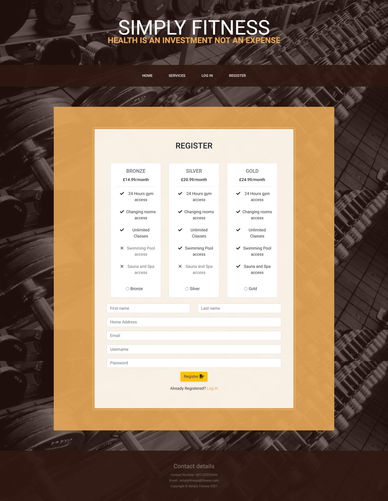
    </p>

________________________________

# Wireframe

- Wireframes were made at the start of the project to create a specific framework for this website. 
### **Wireframe Screenshots:**
<p align="center">Home Page Wireframe</p>
<p align="center">
  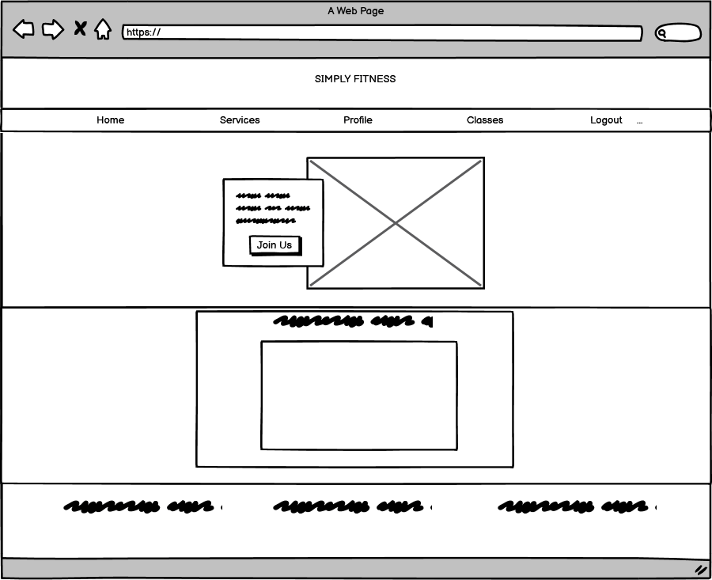
</p>
<p align="center">Services Page Wireframe</p>
<p align="center">
  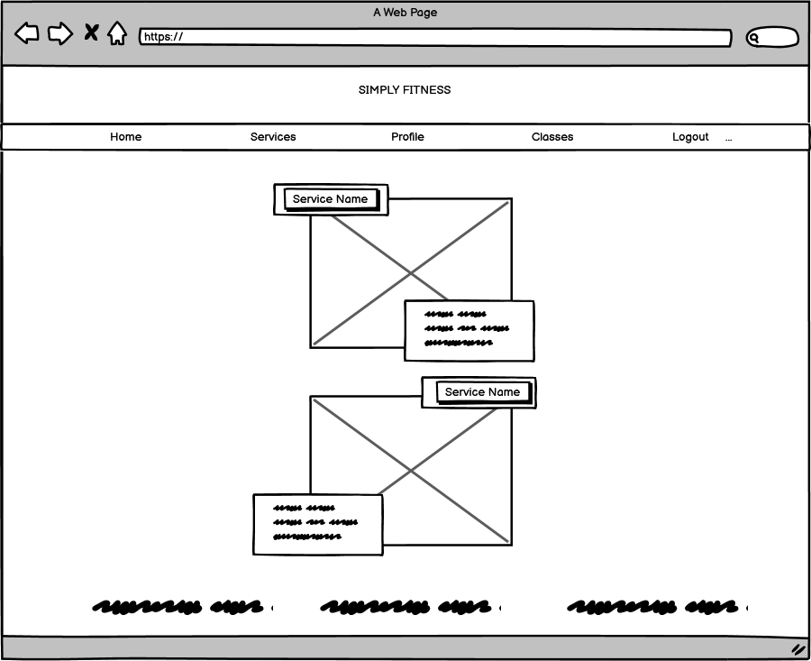
</p>
<p align="center">Profile Page Wireframe</p>
<p align="center">
  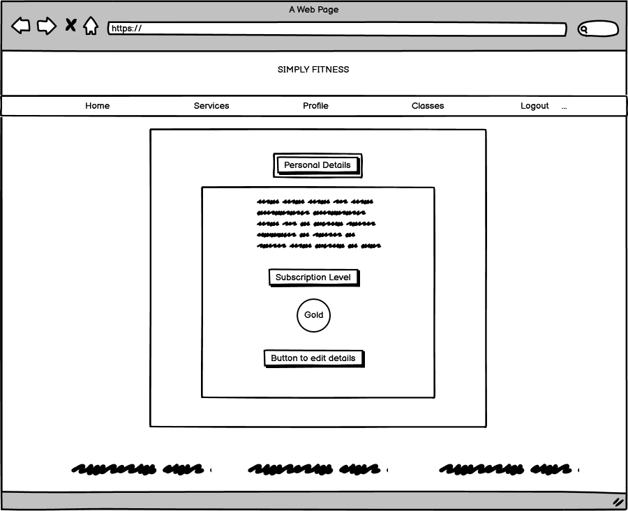
</p>
<p align="center">Classes Page Wireframe</p>
<p align="center">
  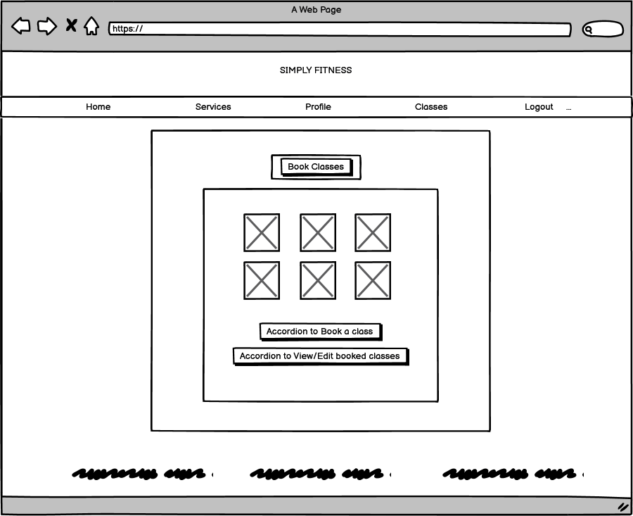
</p>
<p align="center">Login Page Wireframe</p>
<p align="center">
  
</p>
<p align="center">Registration Page Wireframe</p>
<p align="center">
  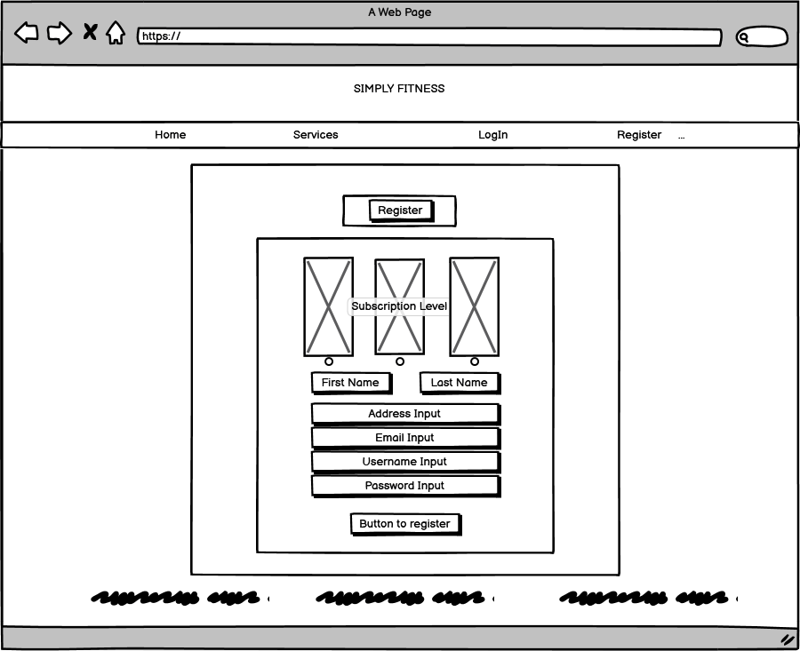
</p>

________________________________

# Deployment

To deploy [SimplyFitness](https://simply-fitness.herokuapp.com/) please follow the following steps: 

1. Getting Started: You will have to go on GitHub [repository](https://github.com/MannyBinning/simply-fitness) and click on the "code" button:

2. Installing modules: Once loaded, inside the terminal install the modules required for this application using pip, -m and requirements.txt.

3. Setting up Database: Using [MongoDB](https://www.mongodb.com/), create 3 collections named, categories, tasks and users in simply_fitness database. 

4. Store the data: Create a file called env.py containing the following code:

    ```
    import os

    os.environ.setdefault("IP", "0.0.0.0")
    os.environ.setdefault("PORT", "5000")
    os.environ.setdefault("SECRET_KEY", "your_secret_key_here")
    os.environ.setdefault("MONGO_URI", "your_own_uri")
    os.environ.setdefault("MONGO_DBNAME", "your_own_file_name")

    ```

    All the above information can be collected from the Overview tab within the MongoDB cluster dashboard. Once clicked on Connect and then in the modal, click the Connect your application button, where the driver needs to be 'Python' and application code will be given. 

5. Confidentiality: As env.py contains sensible information it will be stored in .gitignore to prevent it from getting pushed to git hub. 

6. Ready: After the above steps are completed, you can now use python3 run.py to get the application running in your local browser. 

### Deployment to Heroku

To deploy [SimplyFitness](https://simply-fitness.herokuapp.com/) please follow the following steps: 

1. Heroku needs to be aware of the dependencies the application has and to achieve that, the requirements.txt file needs to be created containing the list of the dependencies. For this, the command pip3 freeze –local > requirements.txt can be used.

2. Heroku needs to know all the files that run the app and to ensure that Procfile needs to be installed. 

3. Login at [Heroku](https://dashboard.heroku.com/apps), create a new app. 

4. On the deploy screen, select GitHub in the deployment section and select your app from the options of your GitHub repositories. 

5. Within settings sections create config vars, these are the same as environment variables in env.py file. These are used here as they cant be found on the GitHub page so will need to be set up on Heroku to get the application working.

6. Automatic Deployment will need to be enabled on the settings page so that Heroku runs the most recent update. 

7. Finally, the master branch will need to be deployed and the link will be received to run SIMPLY FITNESS. https://simply-fitness.herokuapp.com/

<p align="center">
  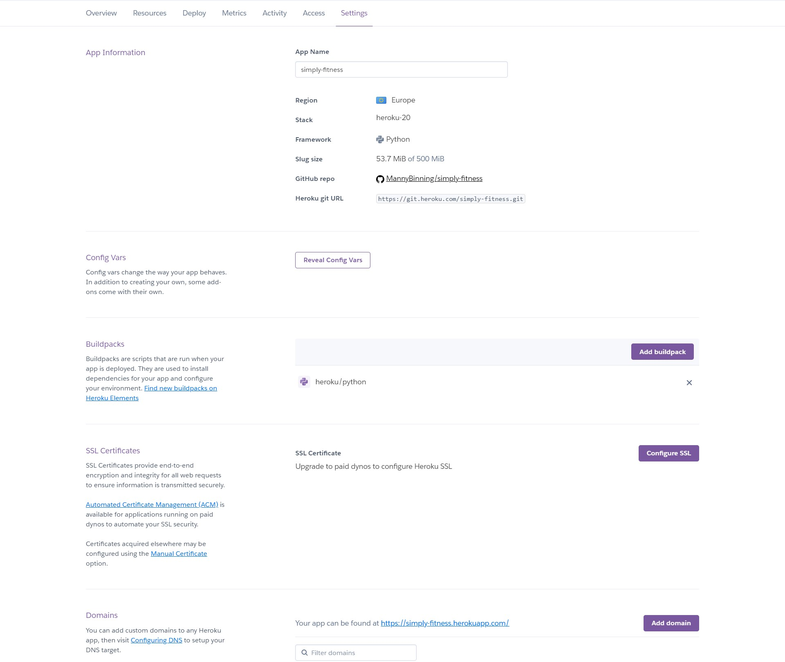
</p>
________________________________

# Code Validation

- Python Validation Tested through [PEP8](http://pep8online.com/) 
<p align="center">
  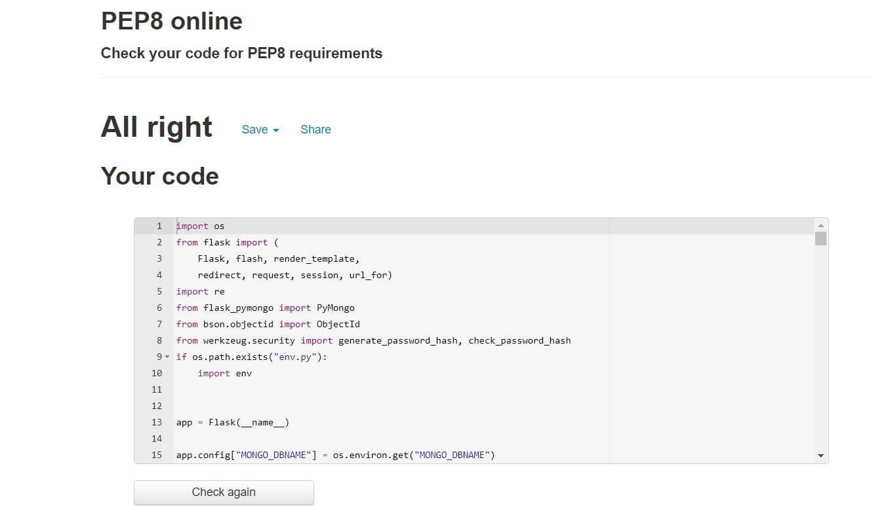
</p>

- HTML Validation Tested through [W3C](https://validator.w3.org/#validate_by_uri)
<p align="center">
  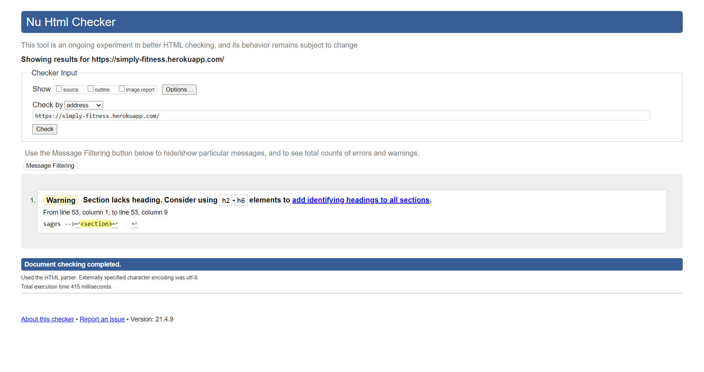
</p>
<p align="center">
  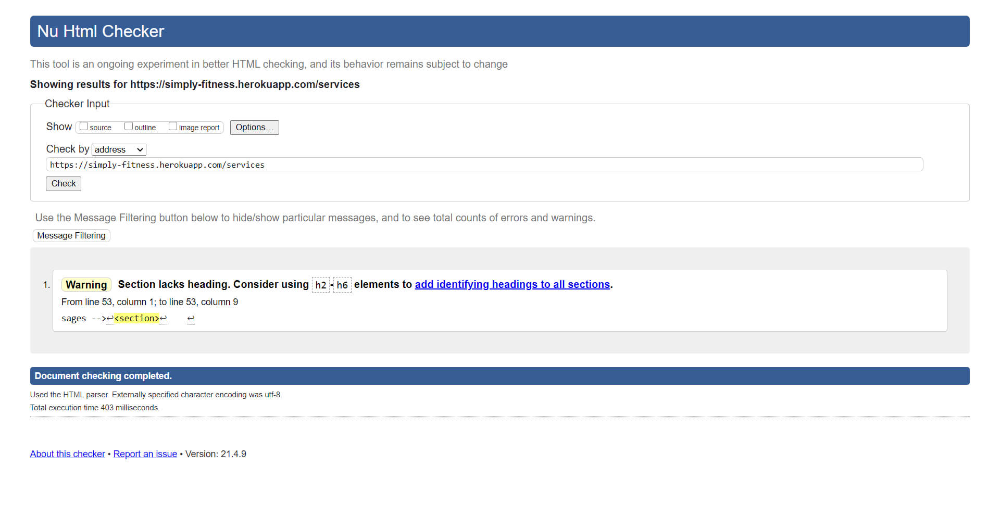
</p>
<p align="center">
  
</p>
<p align="center">
  
</p>
<p align="center">
  
</p>
<p align="center">
  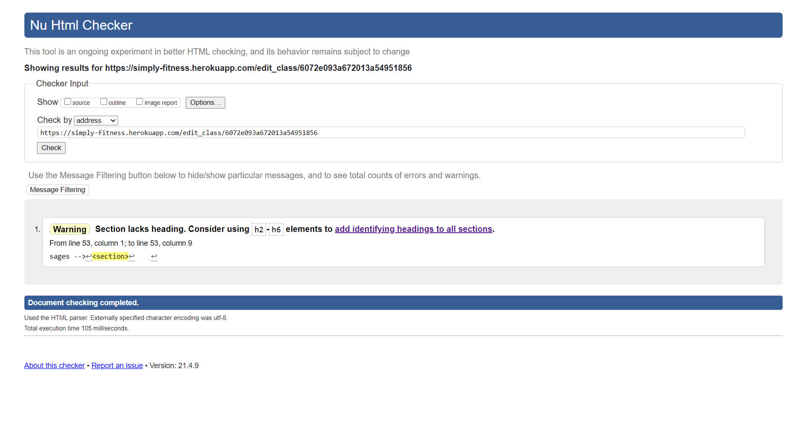
</p>

________________________________

# Testing

### Testing Steps(s):

Following steps demonstrate how all the steps work in the application and how languages have been paired for functionality purpose.
- Base template has been created which contains a header and footer for all the pages and has been linked to all the pages where the main content is extended.
- All the links in the Navbar lead to the pages required and are connected through the route methods in python. 
- Once on HomePage, the Join button has been added to head the users to the Register or Profile Page. 
- Services page has been given Booking buttons to lead the user onto class bookings. 
- Profile page has been given update functionality and deletes functionality routed from python. Information from MongoDB is requested to show the details and an update button is created for the user to update those details. 
- Once clicked on the update button, the user is directed to the update profile page where they can refill the registration form and can submit the form again. Immediately information in MongoDB is updated, which then updates the information on the Profile page. 
- Another button named Delete Account has been added to remove all the information related to that user and will lead the user to the registration page deleting their profile. 
- Book Class paged has also been given two different functionalities, First One containing a form for the user to book their chosen class. This form contains a calendar where the user can only select the future dates for booking. In the form, there is a select section where the categories are requested from MongoDB. 
- Second Section is for the user to view the booked classes where the Details are requested from MongoDB and two buttons are given for each booking. 
  - First Button is to edit the details where the user is taken to another page called edit class. This page contains the same form as book class but with pre-filled inputs. Once submitted the details are changed in MongoDB also updating the bookings page. 
  - Second button is created to remove the classes created by that user, where the details are removed from MongoDB resulting in a class deletion on the profile page as well. 
- Log in and LogOut button has been given functionality to check the details with MongoDB to confirm entered details are correct and acted accordingly. 
- Register page has been added with a form and a submit button where the user is asked to fill in the form and submit it. Information submitted is then stored in MongoDB. 

### Bug(s) and Resolution(s): 
- Bugs are a huge contribution towards learning, same in this profession every bug occurs teaches you a lesson on how you may face problems and ways to find those solutions to overcome these problems. I faced a few problems during this journey listed as following including their resolution source: 
  - First of all, trying to retrieve the information from MongoDB onto the profile page I was failing to do so and the result I was getting wasn't the one expected. 
      - Result expected was to show each item in the section like Username, Full Name, etc. 
      - However, I was receiving the password as well and the details shown were not organised. 
      - Steps taken towards the solution was research and tutor support, The main reason for the unwanted result was that I was requesting the full collection at once.
      - Resolution for this issue was to target each item at a time, such as "{{username.FirtName}}" to receive the first name. 
  
  - The second issue faced was when booking a class when receiving information from MongoDB. 
      - Result expected was to receive the classes booked by that particular user only. 
      - Result I was getting was different as all the classes were shown even the ones created by different users.
      - Steps taken to resolve this issue was to create another document in MongoDB named 'created_by' where the user who creates the class will be stored. Therefore, I could request to show the classes booked only where the current user is equal to the class creator. 
    
  - Another issue I was facing was with the delete functionality.
    - Result expected was to delete the account including all the details for that account. 
    - However, I was getting was just a refreshed page, where all cancel button was working perfectly fine. 
    - Reason behind this issue was a straight forward one as I just had to give submit type to the submit button for the functionality to work. 
  
  - Another issue faced was with the Error 500. 
    - Result expected was for the user to not receive any error pages.
    - However, when the user who isn't logged in, clicks on someone else's profile, it was sending them straight to an error page. 
    - To redirect the user to the login page I used the error handling route in python suggested by my mentor Felipe. Where the user will be redirected to the login page when error 500 is given. 

  - Another issue faced was the form submission on book classes page. 
    - I wanted to make the Select option a requirements for the user where they must select one class.
    - Submission was allowing the user to book the class and value of 'none' was appearing in the booked classes.
    - To fix this issue I had to add an value to the first option and required attribute in select option for it to work. 

### Scalability:
- To enhance this website there will be following features added: 
    - Payment's page will be added for the user to make payments in order to register with the gym. 
    - Email confirmation will be added so the user has to confirm their email before they can register. 
    - I will be adding diet plans for the Gold Subscription users. 
    - Password change feature will be added so the user can update their password if needed. 
________________________________

# Technologies and Tools used

- [HTML5](https://en.wikipedia.org/wiki/HTML5)
- [CSS3](https://en.wikipedia.org/wiki/CSS)
- [JavaScript](https://en.wikipedia.org/wiki/JQuery) / [JQuery](https://en.wikipedia.org/wiki/JavaScript)
- [Python](https://en.wikipedia.org/wiki/Python_(programming_language))
- [Flask](https://en.wikipedia.org/wiki/Flask_(web_framework)) / [RegEx](https://en.wikipedia.org/wiki/Regular_expression)
- [Bootstrap4](https://getbootstrap.com/) was used to organise the content in a grid format. 
- [Balsmiq](https://balsamiq.com/) was used to create the wireframes.
- [Google Font](https://fonts.google.com/)  was used all through the website for font.
- [Font Awesome](https://fontawesome.com/) was used for the icons used for the website. 
- [TinyPNG](https://tinypng.com/) was used to compress the images without making any changes to the size. 
- [GTmetrix](https://gtmetrix.com/) was used to test the speed of the website. 
- [StartBootstrap](https://startbootstrap.com/) to get the design of the application.
- [MongoDB](https://www.mongodb.com/) was used for data storage. 
- [Heroku](https://dashboard.heroku.com/apps) / [GitHub](https://github.com/) for deployment. 
- [RandomKeyGen](https://randomkeygen.com/) to generate random keys. 
- [GoogleMaps](https://developers.google.com/maps/documentation/javascript/adding-a-google-map) was used for the location section.
- [DavidLloyd](https://www.davidlloyd.co.uk/) to get content and ideas for this website. 
- [FaviconGenerator](https://favicon.io/favicon-generator/)to design the favicon made for this website. 

________________________________

# Acknowledgement

I would like to thank code institute, for all the help and support provided through the modules, tutor assistance and many other ways of assistance. 
Felipe, my mentor, has once again been a great help for guiding me to the correct path, supporting me at every step of this journey and for rescuing me from any unwanted situation. 
I would like to thank all the tutors from tutor support, who helped me resolve the issues I had by guiding me towards the solution. 
Also, technologies I have used, such as [StartBootstrap](https://startbootstrap.com/), [w3School](https://www.w3schools.com/) and [Slack](https://slack.com/intl/en-gb/) to help me achieve the final version of this site.

________________________________