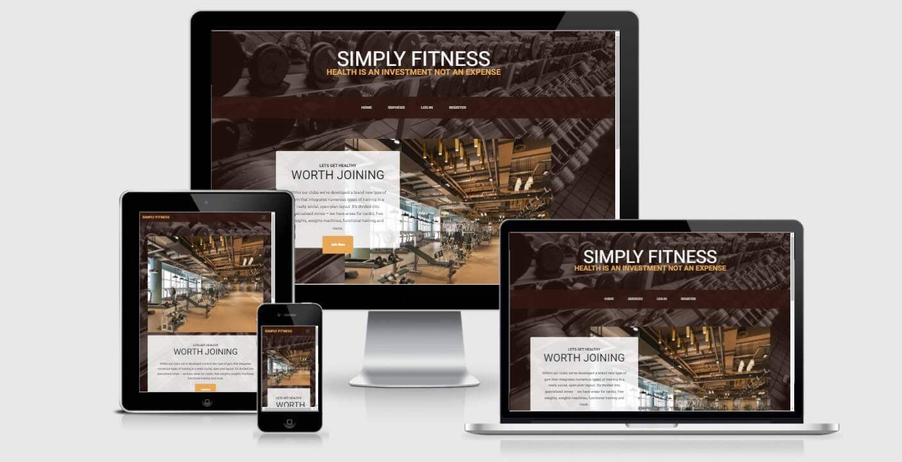

# Description  
- ‘Simple Fitness’ is a fictional gym created for this project. The main objective for creating this website is to make the general public aware of key features within the gym whilst motiving clients to better their fitness regime. 
Additionally, It will allow people to register with the gym thus subsequently become a member of the ‘Simple Fitness’ company. Once becoming a member, users can gain access to their profiles which will contain key personal details. 
This data will be stored in a distinct order to ensure each profile is unique. 

  

________________________________

# UX
### **Home Page:**
- This is the forefront page for the ‘Simple Fitness’ website. Its purpose is to create awareness of what the ‘Simple Fitnesss’ gym can intel and where it is located. The images placed on this web page are specifically designed to show users a visual representation of what they can expect when visiting the gym.

### **Services Page:**
- This page is targeted to provide the general public with knowledgeable information on what services 'Simple Fitness’ has to offer such as, Weights training classes and boot camp. It also informs users on what extra facilities are included within the gym.

### **Profile Page:**
- When becoming a member with ‘Simple Fitness’, each individual will gain access to their profile. This page will contain each user's username, email address, and home address. Each profile is only visible to the registered user when they log into their account and is kept private and confidential.
The profile page also contains the subscription level that the user has chosen with an image of the level for better user visuals. This page then leads on to updating the detail through a button provided at the bottom of the Profile Page, where the user can edit their details.
Every user must confirm their username and password once they have changed their details to save them. If the Username and/or Password are incorrect the changes will be cancelled and the user is returned to editing with an appropriate message displayed. 

### **Classes Page:**
- When becoming a registered member with ‘Simple Fitness’, each individual will gain the privilege to book classes via the website. This page is purely designed for members to gain access/amend those bookings and to create new ones. This page is organised with 6 images displayed at the top providing the user with an idea of what classes can be booked. 
After the images, a form is provided for the user to book their classes for a specific date and time with additional notes if required. Once a class is booked, it is then displayed below in the classes booked section where the user has access to amend or delete only their classes. 

### **Log In Page:**
- This section of the website is designed to allow users to access their profiles. It is only visible on the website when the user hasn't logged into their portal. User will only be allowed to log in if they are already registered and only if the password matches with the given username which is stored in the database. 

### **Register Page:**
- To become a member of ‘Simple Fitness’, each individual will need to register with the company. This page allows users to create a membership by entering a few personal details. Once the details have been recorded, the individual will become a member and begin their journey with ‘Simple Fitness’ gym. 
This page contains a form containing Subscription Level, Full Name, Email, Home Address, Username and Password. 
________________________________

#  User Stories
### **User:**
- As a user, I would like to know what the gym looks like with a location. 
- As a user, I would like to know what services the gym has to offer. 
- As a user, I would like to know what different packages are on offer and suitable for my needs.
- As a user, I would like to upgrade/downgrade my package suitable for my situation at the time.  
- As a user, I would like to know if any extra support can be provided to improve my fitness level. 
- As a user, I would like to gain access to the extra support provided and be able to edit or remove it.

### **Actions taken to accomplish these goals are:**
- Main image has been included for the user to get an idea of what this gym looks like. 
- Home page is provided with a map so the user can see the location of the gym.
- Packages on offer are shown at the registration level with the details, so the user can select the one best suited for them, that can be changed as and when needed. 
- For extra support, the User can also book classes provided by the gym containing different categories, such as boxing, bike, weights and swimming. 
- Classes booked are visible for the user so they can track when their next class is and also they can edit these classes to change the date and time according to their availability. 

________________________________

# Data Structure, Views and Features
- Data Structure was pre-planned for this project, so the user can easily register, create, update, view details and delete details. To achieve this [MongoDB](https://www.mongodb.com/) was used, 
Where I created three collections to store data in them in an organised manner. Where users collection was used to store the database for registered user. 
Categories collection was used to store all different classes options the user can book. This is used for selecting a class in the process to book a class. 
Tasks collection was used to store all the details regarding the class that has been booked for the specific user. 

Collections stored in MongoDB

  

- Working through HTML, CSS and Javascript in my previous projects had taught me how planning and research are key elements in web development. Keeping my main focus on the new language, Python being learnt
in this project I decided to use [Business Casual template](https://startbootstrap.com/previews/business-casual) from start bootstrap. Keeping the same structure as the template I made changes to create different information, content and pages.

    ### **Home Page:**
    - Home Page consists of two sections, the main image at the top with a small message to motivate the user to join us. Join us button has a feature to navigate the user to the registration page or LogIn page if already registered. 
    After the hero image home page will lead the user to find the location of the gym which is shown via google maps including a marker to show the exact location. 

    ### **Services Page:**
    - Service Page contains the services the gym has to offer with images for the user. This page contains the images of the classes and different areas in the gym with a message next to them as a description. 
    Each description contains a button feature leading the logged-in user to book a class; if not yet logged in then it will lead the user to the login page. 

    ### **Profile Page:** 
    - Differentiating this page from the previous pages, this page is only visible if the user is registered so the user can access their profile. Profile Page consists of personal details displayed. 
    User can also view their subscription on this page including an image describing the subscription level. Another feature included on the page is the update button. Which leads the user to the profile editing page. 
        
        #### **Edit Profile**:
        - User is headed to this page once they have chosen to edit the details on the Profile page. This page allows users to edit all their details including subscription level.
        However, for safety purpose, the user has to confirm the username and password. This page also has two buttons, one is to cancel the changes which lead the user back to the profile page without any amendments. 
        The second button is to save the changed and once selected the user is shown an appropriate message to confirm the changes. 

    ### **Classes Page:**
    - Similarly to Profile Page, this is also only visible to a registered user whilst logged in. This page contains 6 images at the top supporting the classes that are available for booking.
    After the images, the user is provided with two accordion options, both options are closed to start with but expand once selected. 
        - First option given leads the user onto the Booking a class.
        This accordion contains a form for the user to submit to book a class which then is stored in a MongoDB collection. The form consists of inputs to gather information, such as 
        Full Name, Class they want to book, Date and time the booking is for and further text if the user wants to add any details or preference. When submitted, the information about the username is also stored in the collection. 

        - Second Option given in the accordion is for the user to view the booked classes. As the user who created the class is also saved in MongoDB, it helps show classes that are booked by the current user only. 
        This accordion gets the details from MongoDB collection, to then present to the user, where the user gets two options;
        whether to edit the booking already made or to delete it if unable to attend. Where the delete button is just to remove the information, the edit button leads the user onto the class editing page. 

        #### **Edit Classes**:
        - User is lead to this page once they have chosen to edit the details for the class already booked. This page consists of a similar form prefilled with previous booking details where the user can edit them accordingly.
        Supporting the form, there are two buttons provided for the user to take action. The first button is to cancel the editing, which doesn't save any changes and leads the user back to the booked classes.
        The second button is to save the changes, which will also be changed in MongoDB, therefore updating the details shown in the booked classes accordion as well. 

    ### **Login Page:** 
    - This page is only accessible when the user isn't already logged in. Features given on this page are to help the user login.
    There are two inputs provided for the user on this page, where both the Username and the Password has to be matching the information stored in MongoDB collection otherwise an appropriate message is shown for the user.
    If the user hasn't yet registered, there is a message displayed containing a link to lead the user to the registration page.
    Once the user manages to login they are directed to the profile page, which contains a logout button in the navbar for the user to logout once finished using the website for the time being. 

    ### **Registration Page:**
    - This page is accessible when the user isn't already logged in or isn't already registered. This page consists of a form containing Subscription levels for choice at the start. Subscription levels are provided with radio buttons,
    so the selected subscription is stored in the MongoDB collection. After the subscription level options, the form contains inputs such as first name, last name, email, address, username, password.
    All these fields have 'required' attribute so the user must fill in the right information. Another feature added on this page is a tool tip so the user knows what characters can be used.
    Username and Password input has been given RegEx support in the backend to make it more secure, where the user is only allowed to use certain characters and numbers for the username and password inputs. 
    Once the user has filled in all the details correctly then they can click on the provided button to register, which will show them an appropriate message and lead the user to their profile page. 
    A message with a link to the login page has also provided for the user who has already registered.

________________________________

# Wireframe
- Wireframes were made at the start of the project to create a specific framework for this website. 
### **Wireframe Screenshots:**

Home Page Wireframe

  

Services Page Wireframe

  

Profile Page Wireframe

  

Classes Page Wireframe

  

Login Page Wireframe

  

Registration Page Wireframe

  

________________________________

# Design and Visual Identity

________________________________

# Site Overview
Following Images are screenshots of the site overview from a desktop: 

________________________________

# Deployment

________________________________

# Code Validation

- Python Validation Tested through [PEP8](http://pep8online.com/) 

  

________________________________

# Testing
### Testing Steps(s):
### Bug(s) and Resolution(s): 

### Scalability:
- To enhance this website there will be following features added: 
    - Payment's page will be added for the user to make payments in order to register with the gym. 
    - Email confirmation will be added so the user has to confirm their email before they can register. 
    - I will be adding diet plans for the Gold Subscription users. 
    - Password change feature will be added so the user can update their password if needed. 
________________________________

# Technologies

________________________________

# Acknowledgement
 
________________________________