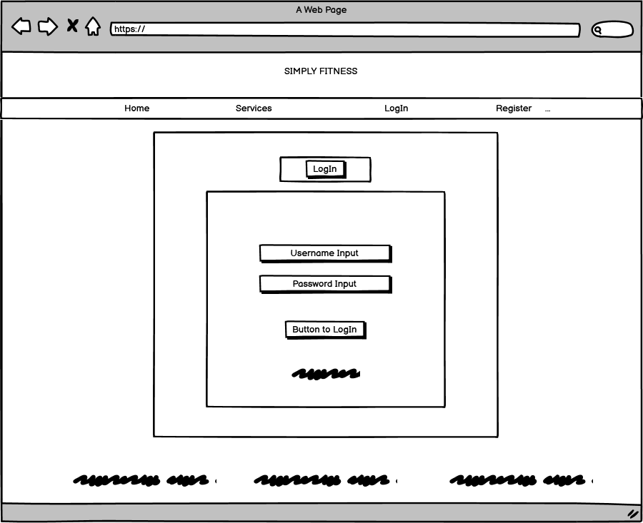

# Description  
- ‘Simple Fitness’ is a fictional gym created for this project. The main objective for creating this website is to make the general public aware of key features within the gym whilst motiving clients to better their fitness regime. 
Additionally, It will allow people to register with the gym thus subsequently become a member of the ‘Simple Fitness’ company. Once becoming a member, users can gain access to their profiles which will contain key personal details. 
This data will be stored in a distinct order to ensure each profile is unique. 

  

# UX
### **Home Page:**
- This is the forefront page for the ‘Simple Fitness’ website. Its purpose is to create awareness of what the ‘Simple Fitnesss’ gym can intel and where it is located. The images placed on this web page are specifically designed to show users a visual representation of what they can expect when visiting the gym.

### **Services Page:**
- This page is targeted to provide the general public with knowledgeable information on what services 'Simple Fitness’ has to offer such as, Weights training classes and boot camp. It also informs users on what extra facilities are included within the gym.

### **Profile Page:**
- When becoming a member with ‘Simple Fitness’, each individual will gain access to their profile. This page will contain each user's username, email address, and home address. Each profile is only visible to the registered user when they log into their account and is kept private and confidential.
The profile page also contains the subscription level that the user has chosen with an image of the level for better user visuals. This page then leads on to updating the detail through a button provided at the bottom of the Profile Page, where the user can edit their details.
Every user must confirm their username and password once they have changed their details to save them. If the Username and/or Password are incorrect the changes will be cancelled and the user is returned to editing with an appropriate message displayed. 

### **Classes Page:**
- When becoming a registered member with ‘Simple Fitness’, each individual will gain the privilege to book classes via the website. This page is purely designed for members to gain access/amend those bookings and to create new ones. This page is organised with 6 images displayed at the top providing the user with an idea of what classes can be booked. 
After the images, a form is provided for the user to book their classes for a specific date and time with additional notes if required. Once a class is booked, it is then displayed below in the classes booked section where the user has access to amend or delete only their classes. 

### **Log In Page:**
- This section of the website is designed to allow users to access their profiles. It is only visible on the website when the user hasn't logged into their portal. User will only be allowed to log in if they are already registered and only if the password matches with the given username which is stored in the database. 

### **Register Page:**
- To become a member of ‘Simple Fitness’, each individual will need to register with the company. This page allows users to create a membership by entering a few personal details. Once the details have been recorded, the individual will become a member and begin their journey with ‘Simple Fitness’ gym. 
This page contains a form containing Subscription Level, Full Name, Email, Home Address, Username and Password. 

#  User Stories

### **Project Goal:**
The user's experience was at the front and center during the development of this project. One of the goals of the project was to create an application that is intuitive and satisfying to use. For this reason, 'Simply Fitness' was built to be usable across all screen sizes,

Starting from user stories, some initial wireframes were sketched out, as well as the application's data structure.

### **User:**
- As a user, I would like to know what the gym looks like with a location. 
- As a user, I would like to know what services the gym has to offer. 
- As a user, I would like to know what different packages are on offer and suitable for my needs.
- As a user, I would like to upgrade/downgrade my package suitable for my situation at the time.  
- As a user, I would like to know if any extra support can be provided to improve my fitness level. 
- As a user, I would like to gain access to the extra support provided and be able to edit or remove it.

### **Actions taken to accomplish these goals are:**
- Main image has been included for the user to get an idea of what this gym looks like. 
- Home page is provided with a map so the user can see the location of the gym.
- Packages on offer are shown at the registration level with the details, so the user can select the one best suited for them, that can be changed as and when needed. 
- For extra support, the User can also book classes provided by the gym containing different categories, such as boxing, bike, weights and swimming. 
- Classes booked are visible for the user so they can track when their next class is and also they can edit these classes to change the date and time according to their availability. 

# Data Structure

# Wireframe
- Wireframes were made at the start of the project to create a specific framework for this website. 
### **Wireframe Screenshots:**

  

  

  

  

  

  

# Design and Visual Identity

# Site Overview
Following Images are screenshots of the site overview from a desktop: 

# Deployment

# Code Validation
# Testing

### Testing Steps(s):
### Bug(s) and Resolution(s): 

### Scalability:

# Technologies

# Acknowledgement
 
